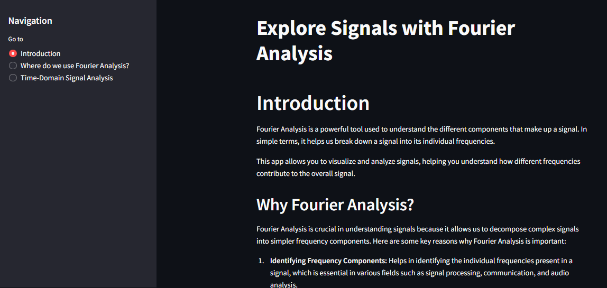
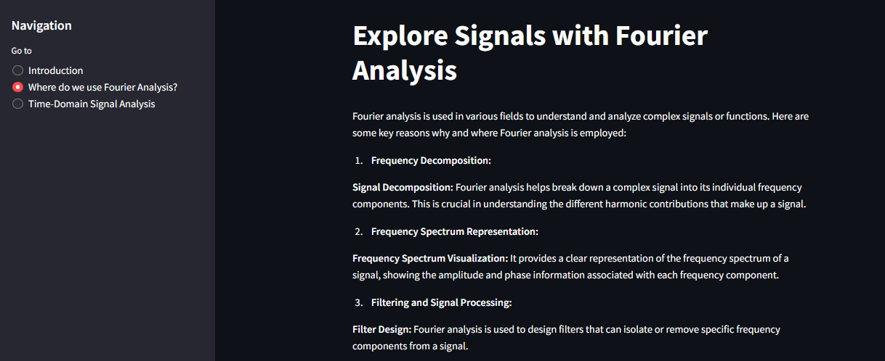
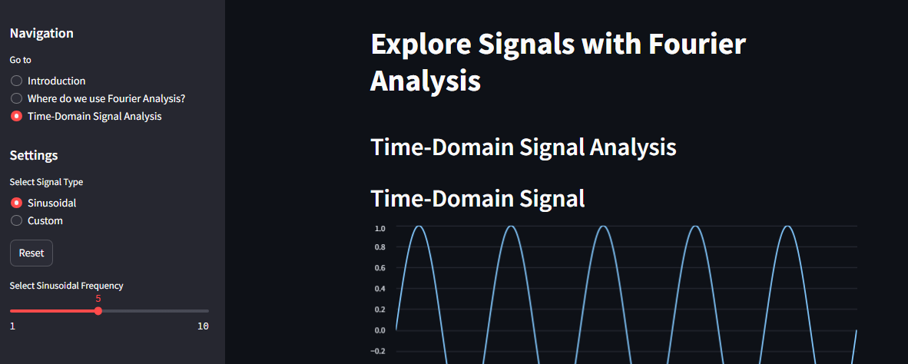
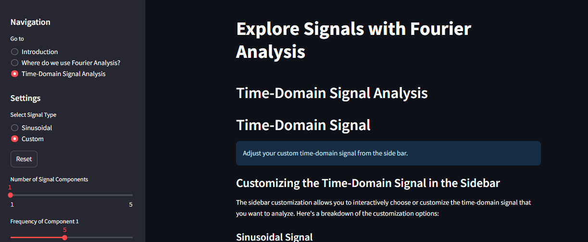

# Streamlit Fourier Analysis App

## Overview

Explore Signals with Fourier Analysis is a Streamlit web application that allows users to visualize and analyze signals using Fourier analysis. The app breaks down signals into individual frequency components, providing insights into the composition and behavior of different frequencies.

## Features

- **Introduction:** Understand the basics of Fourier analysis and its application in signal analysis.

- **Why Fourier Analysis?:** Explore the significance of Fourier analysis in various scientific and engineering fields.

- **Time-Domain Signal Analysis:** Visualize and analyze time-domain signals, including sinusoidal signals and custom signals with adjustable components.

- **Frequency Analysis:** View the frequency spectrum of signals through Fourier analysis, observing the contribution of different frequencies.

- **Continuous Wavelet Transform (CWT) Analysis:** Analyze how different frequencies change over time in a signal using the Continuous Wavelet Transform.

- **Fixed Sidebar:** The sidebar is fixed and does not collapse, providing a consistent navigation experience.

## Usage

1. Clone the repository:

   ```bash
   git clone https://github.com/shfarhaan/Just-For-Fun.git
   ```

2. Install dependencies:

   ```bash
   pip install -r requirements.txt
   ```

3. Run the Streamlit app:

   ```bash
   streamlit run app.py
   ```

4. Open your browser and navigate to `http://localhost:8501` to interact with the app.

## Screenshots

### Introduction Section


### Why Fourier Analysis Section


### Time-Domain Signal Analysis Section
## Select Signal Type - Sinusoidal


## Select Signal Type - Custom



## Contributing

Feel free to contribute to this fun repo if you feel like so by opening issues, submitting pull requests, or providing suggestions for improvement.


## Acknowledgments

- [Streamlit](https://streamlit.io/) - The app framework used for creating interactive web applications with Python.

- [NumPy](https://numpy.org/) - The fundamental package for scientific computing with Python.

- [Matplotlib](https://matplotlib.org/) - A comprehensive library for creating static, animated, and interactive visualizations in Python.

- [PyWavelets](https://pywavelets.readthedocs.io/) - A Python library for wavelet transforms.

## Author

Sazzad Hussain Farhaan (@shfarhaan)
